# SAM's Milestone

## Introduction

In this guide, we'll walk through the process of building a simple website using HTML for structure, CSS for styling, and JavaScript for interactivity. from 3 elements I build a simple **Portofolio Website** . I kindly wait for your comments, and inspire from you for me to elevate my work.

Welcome to my first milestone!

## Table of Contents

1. [Structuring My Project](#structuring-my-project)
   - [Project Folder](#project-folder)
   - [File Structure](#file-structure)

2. [Clone GitHub Into My Local Files][def]
   - [Project Folder](#project-folder)
   - [File Structure](#file-structure)

2. [HTML - Creating the Structure](#html-creating-the-structure)
   - [Basic HTML Template](#basic-html-template)
   - [Adding Content](#adding-content)

3. [CSS - Styling Your Website](#css-styling-your-website)
   - [Linking CSS](#linking-css)
   - [Applying Styles](#applying-styles)

4. [JavaScript - Adding Interactivity](#javascript-adding-interactivity)
   - [Linking JavaScript](#linking-javascript)
   - [Event Handling](#event-handling)

5. [Conclusion](#conclusion)

## My Workflow

## I. Structuring My Project

### Project Folder

Create a dedicated folder for your project to keep files organized.

I'm Using __gitbash__ to make a new folders and files. Also i clone my **milestone-1** repository to my folder

### File Structure

Follow a clear file structure, separating HTML, CSS, and JavaScript files.
I use external CSS and JavaScript files and imported it into the my HTML using this:

```html
<!-- import my external CSS -->
<link rel="stylesheet" href="src/style.css">

<!-- import my external javascript -->
<script src="src/script.js"></script>
```
>$\textsf{\color{red}IMPORTANT: Make sure your CSS and JS file on local and imported have a same name}$ 


$\textsf{\color{Green}}$ 
## HTML - Creating the Structure

### Basic HTML Template

```html
<!DOCTYPE html>
<html lang="en">
<head>
    <meta charset="UTF-8">
    <meta name="viewport" content="width=device-width, initial-scale=1.0">
    <title>Your Website</title>
    <link rel="stylesheet" href="styles.css">
</head>
<body>

</body>
<script src="script.js"></script>
</html>
```


### II. Clone GitHub Into My Local Files

```bash

<!-- Move to your local workspace -->
$ cd new-folder

<!-- Make a new file or folder -->
$ mkdir your-folder 
$ mkdir my-file.html

<!-- For cloning -->
$ git clone https://github.com/revou-fsse-3/milestone-1-SamuelAlvianM.git

<!-- Check if your GitHub is connected -->
Viole@MSI MINGW32 /c/milestone1SE/milestone-1-SamuelAlvianM (main)
$ ls
README.md  assets/  index.html  src/

Viole@MSI MINGW32 /c/milestone1SE/milestone-1-SamuelAlvianM (main)
$ dir
README.md  assets  index.html  src

Viole@MSI MINGW32 /c/milestone1SE/milestone-1-SamuelAlvianM (main)
$ ls -a
./  ../  .git/  README.md  assets/  index.html  src/ 
# under "$" is the result of your command
```
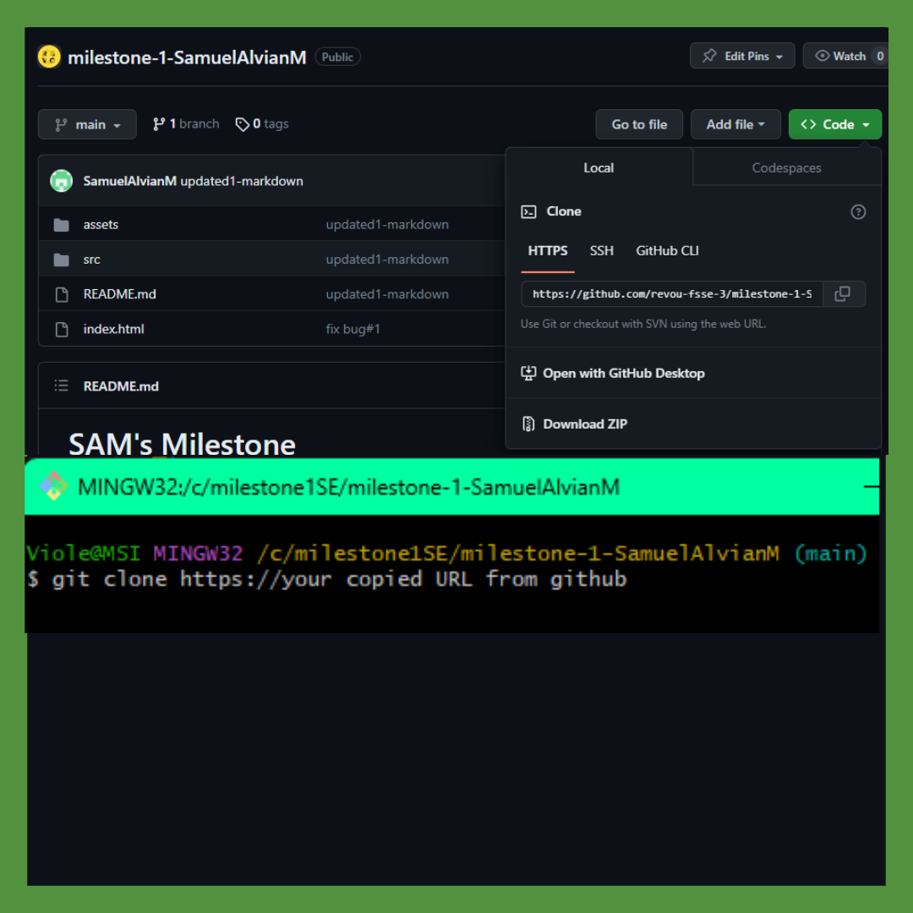

### III. Synchronize My GitHub to Netlify

### $\textsf{\color{green} Step 1: Sign Up to Netlify}$
+ Make sure you have a Github Account.
+ Go to the Netlify website: [https://www.netlify.com/](https://www.netlify.com/).
+ Click the "Sign Up" button and follow the registration process. Or sign with GitHub
+ Verify your email address to activate your Netlify account.
+ if you sign with github, you need to authenticate your account.

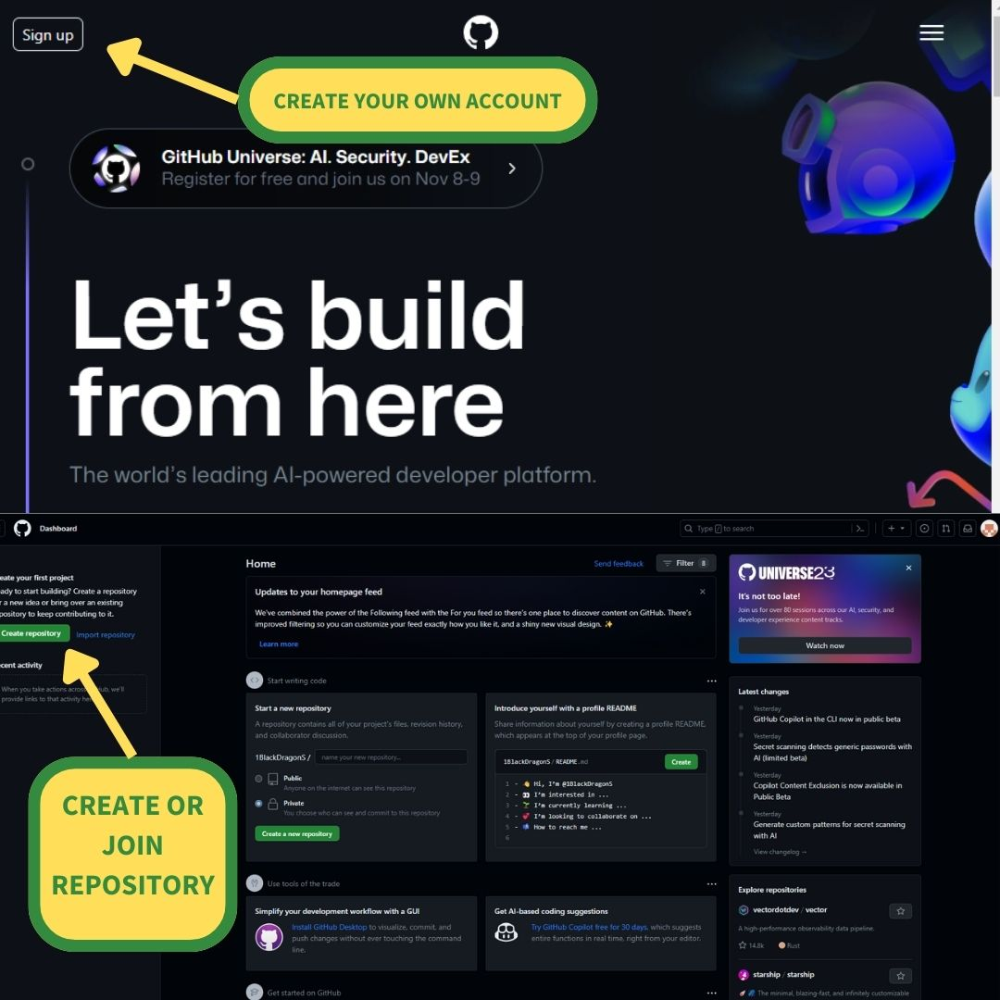

### $\textsf{\color{green} Step 2: Connect Netlify to GitHub}$
* Log in to your Netlify account.
* Click "New site from Git" on the Netlify dashboard.
* Choose your Git provider, which is GitHub in this case.
* Authorize Netlify to access your GitHub repositories.
* Select the GitHub repository you want to deploy.

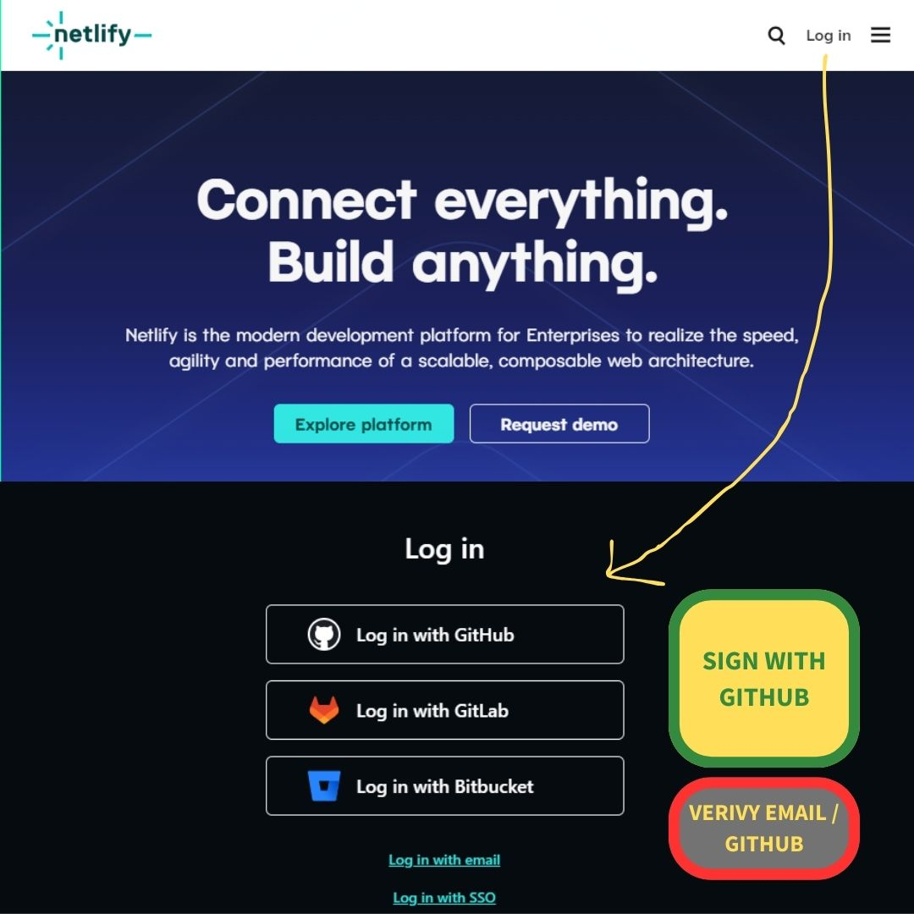

## The _Auto_ Deploy on Netlify from GitHub

### $\textsf{\color{green} Step 1: Configure Build Settings}$
* After selecting your repository, you'll be prompted to configure build settings.
* Choose your build settings, including the branch you want to deploy from.
* Click "Deploy site" to initiate the first deployment.


### $\textsf{\color{green} Step 2: Automatic Updates from GitHub}$
* Netlify will automatically build and deploy your site when you push updates to the specified branch on GitHub.
* Any changes made in the selected branch will trigger an automatic update on Netlify.


### IV. Make my HTML

I Use HTML 5 to this project and I make my web pages using semantics like:
>body, header, section, footer, and form.

> This is my all pages look like:
>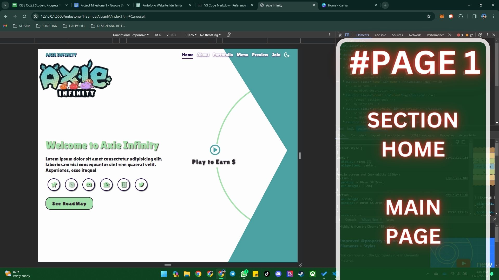
>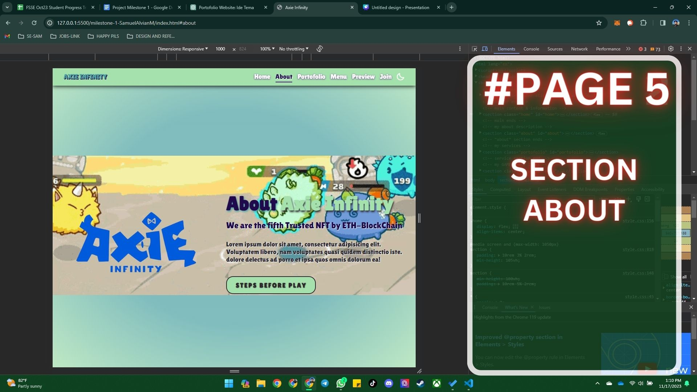
>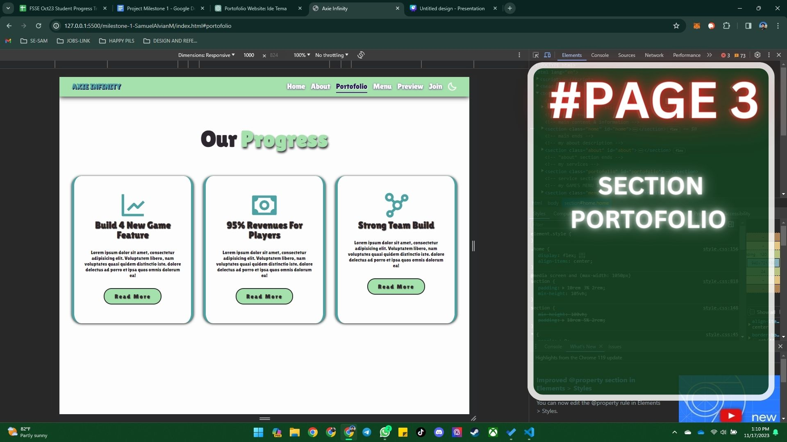
>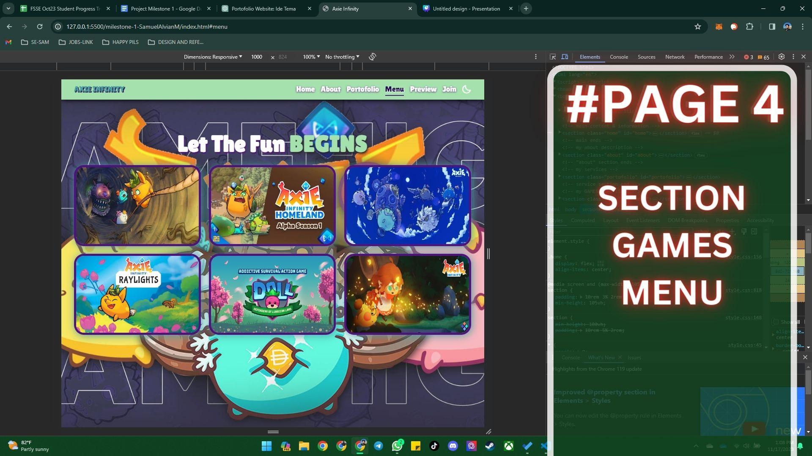
>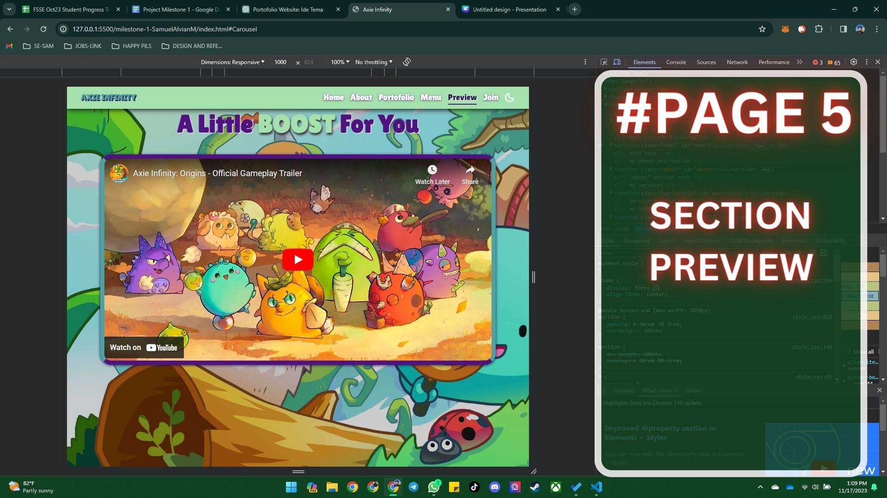
>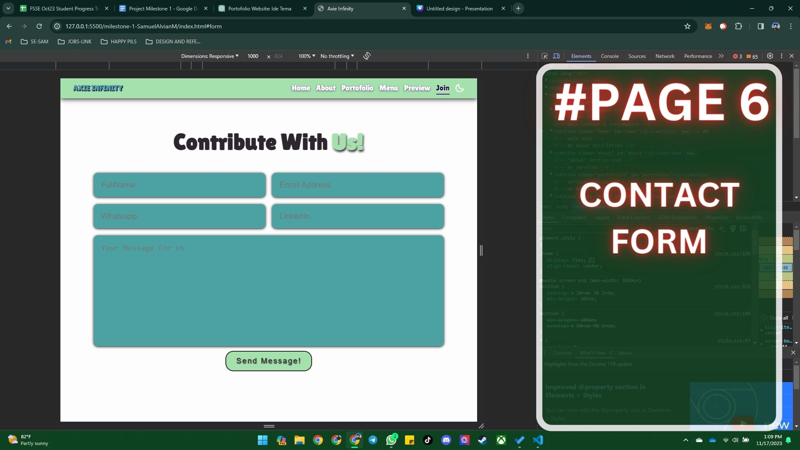


I have 6 Section and each of my section conatins my content:
```html
    <!-- add my navigation and darkmode toggle with header -->
    <header class="header"> </header>

    <!-- my first page Opening/ the first view -->
    <section class="home" id="home"></section>

    <!-- my second page  -->
    <section class="about" id="about"></section>

    <!-- my third page Games Menu linked to another directory-->
    <section class="menu" id="menu"></section>

    <!-- my fourth page preview taken from youtube  -->
    <section class="Preview-container" id="Carousel" aria-label="Gallery"><section> 

    <!-- my fifth page  -->
    <section class="contact" id="form"></section>

    <!-- my sixth page  -->
    <footer class="footer"></footer>

```

#### - Web Links -
Every Link is opened at new window so my website won't be closed. I'm Using:
```html
<!-- EXAMPLE MY "HOME" SECTION  -->
        <div class="social-media">
            <a href="https://app.axieinfinity.com/marketplace/axies/" target="blank"><i class='bx bxs-dog' ></i></a>
        </div>
```
>+ $\textsf{\color{red} href }$ - Defines my link to another website or my internal web page.
>+ $\textsf{\color{red} target="blank" }$ - Directing your link to a new Window on your browser when it clicked.
>+ $\textsf{\color{red} class="class-name" }$ - Unique Selector when you Styling with CSS.

#### Button and Form

I'm using this code to make my buttons on every section and This also how i make my  form

```html
<!-- EXAMPLE MY "HOME" SECTION  -->
        <form action="#">
            <div class="input-box">
                <input type="text" placeholder="FullName">
                <input type="email" placeholder="Email Address">
            </div>
            <div class="input-box">
                <input type="number" placeholder="Whatsapp">
                <input type="text" placeholder="LinkedIn">
            </div>
            <textarea placeholder="Your Message For Us" name="" id="" cols="30" rows="10"></textarea>
            <input type="submit" value="Send Message!" class="btn">
        </form>
        <!-- you can also add -->
        <label for="Full Name">Full Name </label>
        <!-- for giving name to your input area  -->
        <label for="password">Password:</label>
        <input type="password" id="password" name="password" required>


```

>+ $\textsf{\color{red} form }$ - Defines you want to make a form on your web page.
>+ $\textsf{\color{red} label }$ - giving an information to your **input type** name list on your form.
>+ $\textsf{\color{red} input }$ - Make space for user to input their information as you need.
>+ $\textsf{\color{red} class="btn" }$ - styled with CSS and it can be clicked to run something like "action" or your next steps like 
>+ $\textsf{\color{red} value="yout text" }$ - Give a name for your button, it's not just a text, 
>> 1. You can show your button with icon using **i Class** in **a href** and style it like button.
>> 2. You can also use tag "span" to make buttons.


### V. Styling With CSS
The provided CSS code defines the styling for a website using custom properties, media queries, and keyframes for animations. The website features a responsive design with adjustments for different screen sizes, a dark mode, and creative elements such as animated profiles and gradient backgrounds.


### VI. Add My Milestone with "Some Sweets" with JavaScript

This markdown document provides a detailed explanation of the JavaScript code for a website, covering features such as a toggle for a hamburger menu, a sticky navbar with scroll section active links, dynamic text changes, and dark mode toggle.

## 1. Hamburger Menu Toggle

```javascript
// make toggle for hamburger
const menuIcon = document.querySelector('#menu-icon');
const navbar = document.querySelector('.nav-links');

menuIcon.onclick = () => {
    menuIcon.classList.toggle('bx-x-circle');
    navbar.classList.toggle('active');
};
```
>

This section of the code handles the toggle functionality for the hamburger menu. It selects the menu icon and the navigation bar, toggling the 'bx-x-circle' class on the menu icon and the 'active' class on the navigation bar when the menu icon is clicked.

## 2. Sticky Navbar & Scroll Section Active Link

```javascript
// sticky navbar & scroll section active link
const sections = document.querySelectorAll('section');
const navLinks = document.querySelectorAll('header nav a');

window.onscroll = () => {
    sections.forEach(sec => {
        let top = window.scrollY;
        let offset = sec.offsetTop - 150;
        let height = sec.offsetHeight;
        let id = sec.getAttribute('id');

        if (top >= offset && top < offset + height) {
            navLinks.forEach(Links => {
                Links.classList.remove('active');
                document.querySelector('header nav a[href*=' + id + ']').classList.add('active');
            });
        }
    });

    let header = document.querySelector('.header');

    header.classList.toggle('sticky', window.scrollY > 100);

    menuIcon.classList.remove('bx-x-circle');
    navbar.classList.remove('active');
};
```
This part of the code manages the sticky navbar and the active link highlighting as the user scrolls through different sections. It utilizes the 'onscroll' event to determine the active section based on the user's scroll position and updates the navigation links accordingly. Additionally, it toggles the 'sticky' class on the header when the user scrolls more than 100 pixels.

>

## 3. Dynamic Text Change

```javascript
document.addEventListener('DOMContentLoaded', function () {
    const dynamicWord = document.getElementById('dynamicText');
    const words = ['Service', 'Progress', 'Achievements'];
    let index = 0;

    function changeWord() {
        dynamicWord.style.opacity = 0;
        setTimeout(function () {
            dynamicWord.textContent = words[index];
            dynamicWord.style.opacity = 1;
            index = (index + 1) % words.length;
        }, 500);
    }
    // Call changeWord initially
    changeWord();

    // Set up an interval to call changeWord every, for example, 2000 milliseconds (2 seconds)
    setInterval(changeWord, 2000);
});
```
This part of the code dynamically changes text content in an element with the id 'dynamicText' on the document load. It defines an array of words and utilizes a 'changeWord' function to cycle through these words with a fade effect.
>

## 4. Dark Mode Toggle

```javascript
// LDM
const LDM = document.querySelector('#darkMode-icon');

LDM.onclick = () => {
    LDM.classList.toggle('bx-sun');
    document.body.classList.toggle('dark-mode');
};
```

>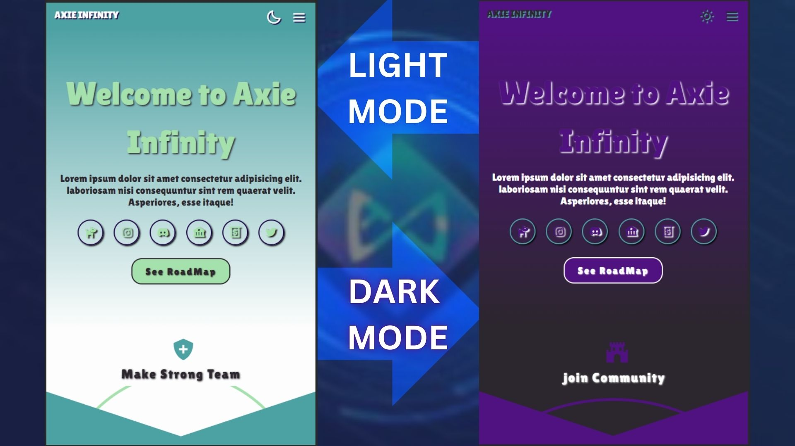

The last part of the code handles the dark mode toggle. It selects the element with the id 'darkMode-icon' and toggles the 'bx-sun' class on it. Simultaneously, it toggles the 'dark-mode' class on the body element, allowing for a switch between dark and light modes.

This JavaScript code combines various functionalities to enhance the user experience on the website, providing interactive features and dynamic content updates.


### VII. Deploy My Content to Custom Domain

### $\textsf{\color{green} Step 1: Configure Custom Domain on Netlify}$
+ In your Netlify dashboard, select your site.
+ Under "Settings," go to the "Domain management" section.
+ Click "Add custom domain" and enter your purchased domain name.
+ Follow the instructions to verify and set up DNS records for your domain.
+ Netlify will configure your site to use the custom domain.

.jpg)

## Manage Domain on Netlify

### $\textsf{\color{green} Step 2: Go to "site" and choose Domain Management}$
+ In your netlify Dashboard, select Site.
+ Choose Domain Management to set up your custom domain.
+ Click "add a domain" and enter your domain name.
+ Your Domain name must be match with the custom name you've made on your domain provider.

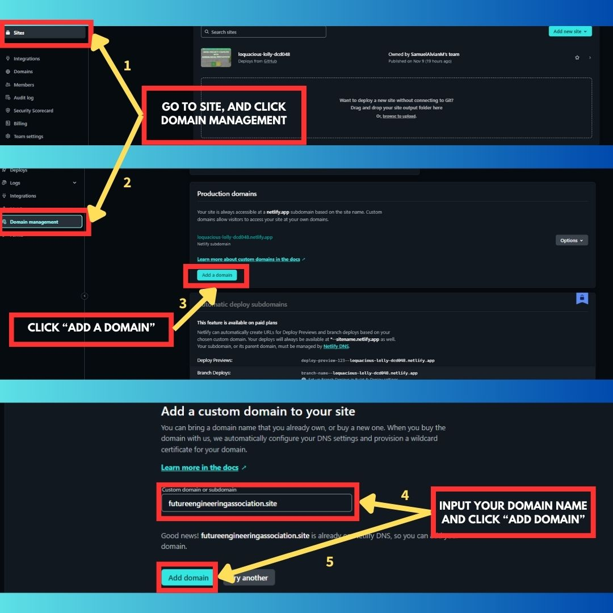

### $\textsf{\color{green} Step 3: Check your Production Domains}$
+ After your custom domain registered on domain management, you must wait the synchronization and configuration between your Netlify DNS and domain provider site. 
+ It will take hours (max 24h) for the "awautubg External DNS turned into "Netlify DNS".
+ If it does, your custom domain or your website is online now.

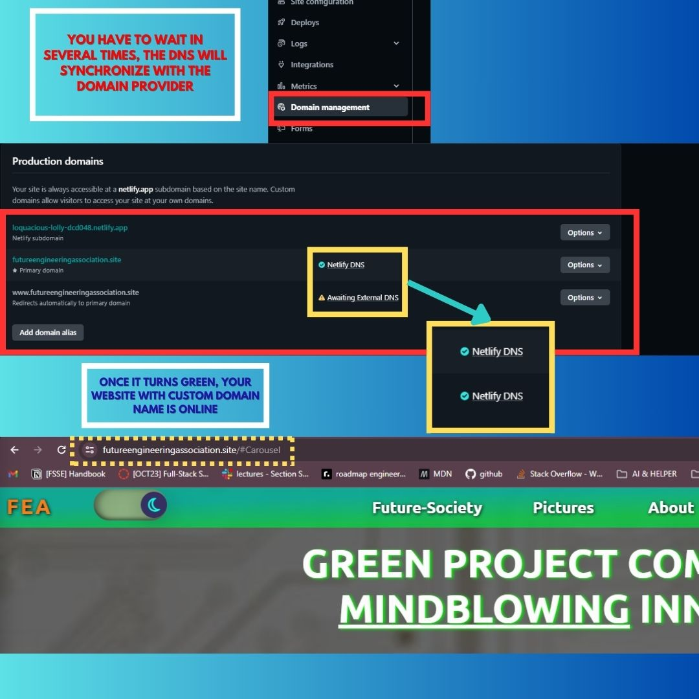


