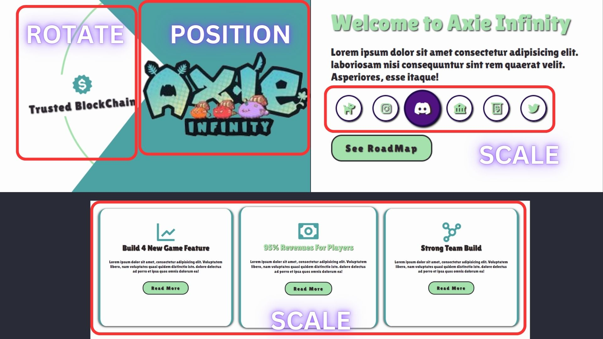
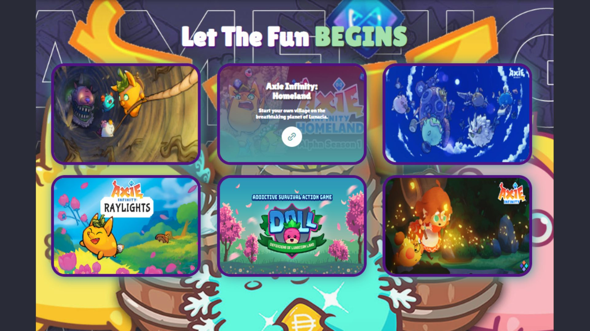

# SAM's Milestone

### My [Milestone-1 Project](https://futureengineeringassociation.site/)

## Introduction

In this guide, we'll walk through the process of building a simple website using HTML for structure, CSS for styling, and JavaScript for interactivity. from 3 elements I build a simple **Portofolio Website** . I kindly wait for your comments, and inspire from you for me to elevate my work.

Welcome to my first milestone!

## Table of Contents

# Table of Contents

#### [I. Structuring My Project](#i-structuring-my-project)
- ##### [Project Folder](#project-folder)
- ##### [File Structure](#file-structure)
- ##### [HTML - Creating the Structure](#html---creating-the-structure)
- ##### [Basic HTML Template](#basic-html-template)

####  [II. Clone GitHub Into My Local Files](#ii-clone-github-into-my-local-files)

####  [III. Synchronize My GitHub to Netlify](#iii-synchronize-my-github-to-netlify)
- ##### [Step 1: Sign Up to Netlify](#step-1-sign-up-to-netlify)
- ##### [Step 2: Connect Netlify to GitHub](#step-2-connect-netlify-to-github)
  - ######  [The _Auto_ Deploy on Netlify from GitHub](#the-_auto_-deploy-on-netlify-from-github)
  - ######  [Step 1: Configure Build Settings](#step-1-configure-build-settings)
  - ######  [Step 2: Automatic Updates from GitHub](#step-2-automatic-updates-from-github)

####  [IV. Make my HTML](#iv-make-my-html)
- ######  [- Web Links -](#-web-links-)
- ######  [Button and Form](#button-and-form)

####  [V. Styling With CSS](#v-styling-with-css)
- ##### [1. Root Variables](#1-root-variables)
- ##### [2. Scrollbar Styling](#2-scrollbar-styling)
- ##### [3. Dark-mode Implementation](#3-dark-mode-implementation)
- ##### [4. Common Styling](#4-common-styling)
- ##### [5. Font-Face](#5-font-face)
- ##### [6. Header Styling](#6-header-styling)
- ##### [7. Menu Icon Styling](#7-menu-icon-styling)
- ##### [8. Sticky Header Styling](#8-sticky-header-styling)
- ##### [9. Logo Styling](#9-logo-styling)
- ##### [10. Navigation Styling](#10-navigation-styling)
- ##### [11. Class-Section Styling](#11-class-section-styling)
  - ######  [A. Transform Scale, Transition, and hove](#a-transform-scale-transition-and-hover)
  - ######  [B. Nth-child and Keyfram](#b-nth-child-and-keyframe)
  - ######  [C.  Before and Afte](#c--before-and-after)
  - ######  [D. .activ](#d-active)
  - ######  [E. Display: gri](#e-display-grid)
  - ######  [F.  Scale Uni](#f-scale-unit)
- ##### [12. Call for Action Styling](#12-call-for-action-styling)
- ##### [13. Footer Styling](#13-footer-styling)
- ##### [14. Responsive Design](#14-responsive-design)

####  [VI. Add My Milestone with "Some Sweets" with JavaScript](#vi-add-my-milestone-with-some-sweets-with-javascript)
- #####  [1. Hamburger Menu Toggle](#1-hamburger-menu-toggle)
- #####  [2. Sticky Navbar & Scroll Section Active Link](#2-sticky-navbar--scroll-section-active-link)
- #####  [3. Dynamic Text Change](#3-dynamic-text-change)
- #####  [4. Dark Mode Toggle](#4-dark-mode-toggle)

####  [VII. Deploy My Content to Custom Domain](#vii-deploy-my-content-to-custom-domain)
- ##### [Step 1: Configure Custom Domain on Netlif](#step-1-configure-custom-domain-on-netlify)
  - #####  [Manage Domain on Netlify](#manage-domain-on-netlify)
- ##### [Step 2: Go to "site" and choose Domain Managemen](#step-2-go-to-site-and-choose-domain-management)
- ##### [Step 3: Check your Production Domain](#step-3-check-your-production-domains)


# My Workflow

## I. Structuring My Project

### Project Folder

Create a dedicated folder for your project to keep files organized.

I'm Using __gitbash__ to make a new folders and files. Also i clone my **milestone-1** repository to my folder

### File Structure

Follow a clear file structure, separating HTML, CSS, and JavaScript files.
I use external CSS and JavaScript files and imported it into the my HTML using this:

```html
<!-- import my external CSS -->
<link rel="stylesheet" href="src/style.css">

<!-- import my external javascript -->
<script src="src/script.js"></script>
```
>$\textsf{\color{red}IMPORTANT: Make sure your CSS and JS file on local and imported have a same name}$ 


$\textsf{\color{red}}$ 
### HTML - Creating the Structure

### Basic HTML Template

```html
<!DOCTYPE html>
<html lang="en">
<head>
    <meta charset="UTF-8">
    <meta name="viewport" content="width=device-width, initial-scale=1.0">
    <title>Your Website</title>
    <link rel="stylesheet" href="styles.css">
</head>
<body>

</body>
<script src="script.js"></script>
</html>
```


## II. Clone GitHub Into My Local Files

```bash

<!-- Move to your local workspace -->
$ cd new-folder

<!-- Make a new file or folder -->
$ mkdir your-folder 
$ mkdir my-file.html

<!-- For cloning -->
$ git clone https://github.com/revou-fsse-3/milestone-1-SamuelAlvianM.git

<!-- Check if your GitHub is connected -->
Viole@MSI MINGW32 /c/milestone1SE/milestone-1-SamuelAlvianM (main)
$ ls
README.md  assets/  index.html  src/

Viole@MSI MINGW32 /c/milestone1SE/milestone-1-SamuelAlvianM (main)
$ dir
README.md  assets  index.html  src

Viole@MSI MINGW32 /c/milestone1SE/milestone-1-SamuelAlvianM (main)
$ ls -a
./  ../  .git/  README.md  assets/  index.html  src/ 
# under "$" is the result of your command
```


## III. Synchronize My GitHub to Netlify

### $\textsf{\color{red} Step 1: Sign Up to Netlify}$
+ Make sure you have a Github Account.
+ Go to the Netlify website: [https://www.netlify.com/](https://www.netlify.com/).
+ Click the "Sign Up" button and follow the registration process. Or sign with GitHub
+ Verify your email address to activate your Netlify account.
+ if you sign with github, you need to authenticate your account.


## $\textsf{\color{red} Step 2: Connect Netlify to GitHub}$
* Log in to your Netlify account.
* Click "New site from Git" on the Netlify dashboard.
* Choose your Git provider, which is GitHub in this case.
* Authorize Netlify to access your GitHub repositories.
* Select the GitHub repository you want to deploy.


### The _Auto_ Deploy on Netlify from GitHub

### $\textsf{\color{red} Step 1: Configure Build Settings}$
* After selecting your repository, you'll be prompted to configure build settings.
* Choose your build settings, including the branch you want to deploy from.
* Click "Deploy site" to initiate the first deployment.


### $\textsf{\color{red} Step 2: Automatic Updates from GitHub}$
* Netlify will automatically build and deploy your site when you push updates to the specified branch on GitHub.
* Any changes made in the selected branch will trigger an automatic update on Netlify.


## IV. Make my HTML

I Use HTML 5 to this project and I make my web pages using semantics like:
>body, header, section, footer, and form.

> This is my all pages look like:
>
>
>
>
>
>


I have 6 Section and each of my section conatins my content:
```html
    <!-- add my navigation and darkmode toggle with header -->
    <header class="header"> </header>

    <!-- my first page Opening/ the first view -->
    <section class="home" id="home"></section>

    <!-- my second page  -->
    <section class="about" id="about"></section>

    <!-- my third page Games Menu linked to another directory-->
    <section class="menu" id="menu"></section>

    <!-- my fourth page preview taken from youtube  -->
    <section class="Preview-container" id="Carousel" aria-label="Gallery"><section> 

    <!-- my fifth page  -->
    <section class="contact" id="form"></section>

    <!-- my sixth page  -->
    <footer class="footer"></footer>

```

#### - Web Links -
Every Link is opened at new window so my website won't be closed. I'm Using:
```html
<!-- EXAMPLE MY "HOME" SECTION  -->
        <div class="social-media">
            <a href="https://app.axieinfinity.com/marketplace/axies/" target="blank"><i class='bx bxs-dog' ></i></a>
        </div>
```
>+ $\textsf{\color{red} href }$ - Defines my link to another website or my internal web page.
>+ $\textsf{\color{red} target="blank" }$ - Directing your link to a new Window on your browser when it clicked.
>+ $\textsf{\color{red} class="class-name" }$ - Unique Selector when you Styling with CSS.

#### Button and Form

I'm using this code to make my buttons on every section and This also how i make my  form

```html
<!-- EXAMPLE MY "HOME" SECTION  -->
        <form action="#">
            <div class="input-box">
                <input type="text" placeholder="FullName">
                <input type="email" placeholder="Email Address">
            </div>
            <div class="input-box">
                <input type="number" placeholder="Whatsapp">
                <input type="text" placeholder="LinkedIn">
            </div>
            <textarea placeholder="Your Message For Us" name="" id="" cols="30" rows="10"></textarea>
            <input type="submit" value="Send Message!" class="btn">
        </form>
        <!-- you can also add -->
        <label for="Full Name">Full Name </label>
        <!-- for giving name to your input area  -->
        <label for="password">Password:</label>
        <input type="password" id="password" name="password" required>


```

>+ $\textsf{\color{red} form }$ - Defines you want to make a form on your web page.
>+ $\textsf{\color{red} label }$ - giving an information to your **input type** name list on your form.
>+ $\textsf{\color{red} input }$ - Make space for user to input their information as you need.
>+ $\textsf{\color{red} class="btn" }$ - styled with CSS and it can be clicked to run something like "action" or your next steps like 
>+ $\textsf{\color{red} value="yout text" }$ - Give a name for your button, it's not just a text, 
>> 1. You can show your button with icon using **i Class** in **a href** and style it like button.
>> 2. You can also use tag "span" to make buttons.


## V. Styling With CSS
The provided CSS code defines the styling for a website using custom properties, media queries, and keyframes for animations. The website features a responsive design with adjustments for different screen sizes, a dark mode, and creative elements such as animated profiles and gradient backgrounds.

### 1. Root Variables

```css
    :root {
    --wm-color1: #A5E1AD;
    --font-c1: #fdfdfd;
    --font-c2: #2C272E;
    --wm-color2: #4CA1A3;
    --dm-color1: #511281;
    --dm-color2: #21094E;
    --bg-color: #fdfdfd;
    --shadow-color: rgba(0, 0, 0, 1);
    --i:'0';
}
```
**Description:** The ' $\textsf{\color{red}:root }$' selector is used to define global CSS variables. These variables are utilized throughout the stylesheet to maintain consistency and facilitate easy theme changes. Colors, shadows, and other properties are declared here.

### 2. Scrollbar Styling

```css
::-webkit-scrollbar {
    width: 10px;
}

::-webkit-scrollbar-track {
    background-color: var(--dm-color1);
}

::-webkit-scrollbar-thumb {
    background-color: yellow;
}
```
**Description:** Custom styling for the scrollbar in webkit browsers. The ' $\textsf{\color{red}::-webkit-scrollbar }$' selector targets the scrollbar, ' $\textsf{\color{red}::-webkit-scrollbar-track}$ ' styles the track, and ' $\textsf{\color{red}::-webkit-scrollbar-thumb }$' styles the draggable thumb.

### 3. Dark-mode Implementation

```css
.dark-mode {
    --wm-color1: #511281;
    --font-c1: #2C272E;
    --font-c2: #fdfdfd;
    --wm-color2: #511281;
    --dm-color1: #A5E1AD;
    --dm-color2: #4CA1A3;
    --bg-color: #21094E;
}
```

**Description:** The ' $\textsf{\color{red}.dark-mode}$' class is defined to switch the color scheme for a dark mode. When applied, it changes the values of various variables to create a visually appealing dark theme.

>

### 4. Common Styling

```css
*{
    margin: 0;
    padding: 0;
    box-sizing: border-box;
    text-decoration: none;
    border: none;
    outline: none;
    scroll-behavior: smooth !important;
}

html {
    font-size: 1rem;
    overflow-x: hidden;
    font-family: 'Lilita One', sans-serif;
}

body {
    background: var(--bg-color);
    color: var(--font-c2);
}
```
**Description:** These are common styles applied to reset default margins, padding, and borders, ensuring a $\textsf{\color{red} clean and consistent}$ starting point for styling. The font size is set for the HTML element, and the body background and text color are set using the defined variables.


### 5. Font-Face

```css
@font-face {
    font-family: 'Lilita One';
    src: url(font/LilitaOne-Regular.ttf);
    font-style: normal;
    font-weight: 100;
}

@font-face {
    font-family: 'Lilita One';
    src: url(font/LilitaOne-Regular.ttf);
    font-style: bold;
    font-weight: 400;
}
```

**Description:** '$\textsf{\color{red} @font-face}$' is a CSS rule that allows custom fonts to be loaded. In this case, the 'Lilita One' font is defined with two variations, normal and bold, each associated with a font file. You can input your downloaded **font-file** at your local data, and it's in the same folder with your css file/(s). 

### 6. Header Styling

```css
header {
position: fixed;
top: 0;
left: 0;
 width: 100%;
padding: 1rem 7%;
background: transparent;
display: flex;
z-index: 100;
transition: 0.5s;
}
```

**Description:** The header is styled to be fixed at the top of the page with a transparent background. The transition property adds a smooth animation effect when styles change.

### 7. Menu Icon Styling
```css
#menu-icon {
    font-size: 2rem;
    color: var(--wm-color2);
    text-shadow: 0 2px 1px var(--wm-color1);
    display: none;
}
```
**Description:** The menu icon is initially hidden '(display: none)' and is styled with a color and text-shadow for visual appeal. It becomes visible on smaller screens.

### 8. Sticky Header Styling

```css
.header.sticky {
    background-color: var(--wm-color1);
    box-shadow: 0 0.1rem 1rem var(--shadow-color);
}

```

**Description:** When the header becomes sticky (i.e., when scrolling down), its background color changes, and a subtle box-shadow is applied for a sense of depth.

### 9. Logo Styling

```css
.logo {
    font-size:1.5rem;
    color: var(--wm-color2);
    text-shadow: 2px 2px 1px var(--dm-color2);
    font-weight: 400;
    cursor: default;
}
```

**Description:** Styles the logo with a specific font size, color, text shadow, and cursor style.

### 10. Navigation Styling

```css
nav {
    display: flex;
    align-items: center;
    margin-left: auto;
}

nav ul {
    display: flex;
    list-style: none;
}

nav li {
    margin-right: 2rem;
}

nav a {
    font-size: 1rem;
    color: var(--wm-color2);
    text-transform: uppercase;
    font-weight: 400;
    letter-spacing: 0.1rem;
    transition: 0.3s;
}

nav a:hover {
    color: var(--wm-color1);
}

```

**Description:** Styles for the navigation bar, including flex layout, list styling, and link styling. Hover effects are added for visual feedback.

### 11. Class-Section Styling

**Description:** All About Styling, animation and transformations that i use to this milestone described in code below:

##### A. $\textsf{\color{Orange}Transform Scale, Transition, and hover}$

> The **Transform** I use, targeted to change the $\textsf{\color{Red}scale, position, and angle }$. With ':hover' and transition assisted the transformation of the elements when the cursor targeting the element.
```css
/* example */
/* transformation rotation, changing angle */

@keyframes professionrotate {
    0%,20% {
        transform: rotate(0deg);
    }
    25%,45% {
        transform: rotate(-90deg);
    }
    50%,70% {
        transform: rotate(-180deg);
    }
    75%,95% {
        transform: rotate(-270deg);
    }
    100% {
        transform: rotate(-360deg);
    }
}

/* changing position to X-axis or Y-axis Depends on your choice*/
.home .profile-container {
    transform: translateY(-50%);
}

/* the transition controls timeframe, 0.15 second until the button
change the scale from 1 to 1.2 */
.btn {
    transition: 0.15s ease-in-out;
    transform: scale(1);
}

.btn:hover{
    transform: scale(1.2);
}

```
> **Keyframe Animation:** Defines a fade-in animation (@keyframes fadeIn) for sections that are odd children. The animation gradually changes the opacity from 0 to 1 over a duration of 1 second.

> **Hover effect :** 
>>1. Background and Color Change: On hover, the background changes to --dm-color1, and the text color changes to --bg-color.
>>2. Scale Transformation: The link scales up to 1.4 on hover, creating an interactive effect.

>

##### B. $\textsf{\color{Orange}Nth-child and Keyframe}$

```CSS
section:nth-child(odd) {
    animation: fadeIn 1s ease-in-out;
}

@keyframes fadeIn {
    from {
        opacity: 0;
    }
    to {
        opacity: 1;
    }
}

.home .profile-container .profile-box:nth-child(1) i{
    margin-left: 15px;
}
.home .profile-container .profile-box:nth-child(2),
.home .profile-container .profile-box:nth-child(4){
    padding-bottom: 20px;
}

.profile i {
    font-size: 4rem;
    color: var(--wm-color2);
}

.profile ::before {
    content: var(--i);
    margin-right: 0.5rem;
    
}

.profile:nth-of-type(1) { --i:1; }
.profile:nth-of-type(2) { --i:2; }
.profile:nth-of-type(3) { --i:3; }
.profile:nth-of-type(4) { --i:4; }
```

**Explanation:** selector selects child elements according to their position among all the sibling elements within a parent element. $\textsf{\color{red}nth-of-type}$ give the matches elements based on their position with the siblings elements with the same tag name. the identity given to the elements will be linked to keyframes or animations that we will use.


##### C.  $\textsf{\color{Orange}Before and After}$

**Description:** 
- ::before and/or after used to give the action to the elements. the action are depends on your code that you write on your "before or after" function. Example! I give my '.about' some background overlay so the '.gif' on about section not use to cover the whole page and the second background will overlay it before or after the '.gif' file.

```css
/* my code 'before' */
.about {
    display: flex;
    justify-content: center;
    align-items: center;
    gap: 4rem;
    background-image: url(../assets/axie-axie-infinity.gif);
    background-size: contain;
    background-position: center;
    background-repeat: no-repeat;
}

.about::before {
    content: '';
    position: absolute;
    top: 105%;
    left: 0;
    bottom: 0;
    width: 100%;
    height: 100%;
    background: radial-gradient(var(--wm-color2)50%, var(--wm-color1)); /* Warna hitam dengan opacity 0.5 */
    opacity: 0.7;
    z-index: -1; /* Letakkan di atas background utama */
}

/* more example*/
.call-to-action::before {
    content: '\2022';
    color: var(--wm-color2);
    margin-right: 0.5rem;
}

.call-to-action::after {
    content: '\2022';
    color: var(--wm-color2);
    margin-left: 0.5rem;
}
```

**Another Description:** 
- Properties Used: content, color, margin-right, margin-left
- Description: This code adds decorative bullet points before and after the content of the '.call-to-action' element, using the Unicode character '\2022' (bullet point) and styling it with the specified color.

>

##### D. $\textsf{\color{Orange}.active}$

```css
.nav-links a {
    position: relative;
    font-size: 1.5rem;
    color: var(--font-c1);
    font-weight: 500;
    margin-right: 1rem;
    text-shadow: 1px 1px 2px var(--font-c2);
}

.nav-links a.active {
    color: var(--dm-color2);
    text-shadow: 1px 1px 2px var(--font-c1);
}

.nav-links a.active::before{
    content: '';
    position: absolute;
    left: 0;
    width: 100%;
    height: .2rem;
    background: var(--dm-color1);
    bottom: -6px;
}
```
**Description:** 
+ When the 'nav-links a' get the $\textsf{\color{red}active and before}$, the elements appearance will change, these are some changes:
    - Color Change: When a link has the class "active," its color changes to a value defined by --dm-color2.

    - Text Shadow Update: The text shadow is adjusted for the active link.

    - Indicator Line: An absolutely positioned pseudo-element ::before is used to create a line beneath the active link.

    - Width and Color: The line spans the entire width of the link and has a background color defined by --dm-color1.

    - Positioning: Positioned at the bottom of the link, creating an underline effect with a slight negative bottom offset for better visual alignment.

##### E. $\textsf{\color{Orange}Display: grid}$

```css
.menu .menu-container {
    display: grid;
    grid-template-columns: repeat(3, 1fr);
    align-items: center;
    justify-content: center;
    box-sizing: border-box;
    gap: 1.5rem;
}

```
**Descriptions:**
* $\textsf{\color{red}Display}$: The menu container is set to display as a grid.

* $\textsf{\color{red}Grid Columns}$: The grid is defined with three columns, each occupying an equal  fraction of the available space (1fr).

* $\textsf{\color{red}Alignment}$: Items within the grid are vertically and horizontally centered.

* $\textsf{\color{red}Box Sizing}$: The box-sizing property is set to border-box, ensuring that padding and border are included in the element's total width and height calculations.

* $\textsf{\color{red}Gap}$: Adds a gap of 1.5rem between grid items.
>

##### F. $\textsf{\color{Orange} Scale Unit}$

CSS provides  $\textsf{\color{red}various units for expressing lengths and sizes.}$ Each unit serves a specific purpose and is suitable for different scenarios. Here's an overview of some commonly used CSS units:

1. ==**Pixels (px)**==

**Description:** Pixels are the smallest unit of measurement in CSS.
Use Case: Often used for precise control over element sizes, especially for images and borders.

**Example:**
```css
font-size: 16px;
width: 200px;
```


2. ==**Relative Units**==

+ $\textsf{\color{red} EM (em)}$

**Description:** Relative to the font-size of the element or the font-size of the parent element.
Use Case: Good for creating scalable designs.

**Example:**
```css
font-size: 1.2em;
margin: 1.5em;
```
+ $\textsf{\color{red}REM(rem)}$

**Description:** Relative to the font-size of the root element (html).
Use Case: Useful for maintaining consistent spacing across the entire page.

**Example:**
```css
font-size: 1.5rem;
margin: 2rem;
```

3. ==**Viewport Percentage Units**==

+ $\textsf{\color{red} VW (vw)}$

**Description:** Relative to 1% of the width of the viewport.
Use Case: Useful for creating responsive designs.

**Example:**
```css
width: 50vw;
```

+ $\textsf{\color{red}VH (vh)}$

**Description:** Relative to 1% of the height of the viewport.
Use Case: Helpful for sizing elements based on the viewport height.

**Example:**
```css
height: 75vh;
```

4. ==**Percentage (%)**==

**Description:** Relative to the parent element's size.
- Use Case: Commonly used for fluid layouts and responsiveness.

**Example:**
```css
width: 50%;
```

5. ==**Absolute Units**==
+ **IN (in), CM (cm), MM (mm), PT (pt), PC (pc)**

    + Description: Absolute length units, not recommended for web design due to limited scalability.

    + Use Case: Print stylesheets where physical sizes matter.

    + Example:

```css
width: 2in;
```


6. ==**Grid Units**==

+ Frame (fr)

**Description:** Fractional unit used in grid layouts.

**Use Case:** Defines a fraction of the available space within the grid container.

**Example:**

```css
grid-template-columns: 1fr 2fr;
```

7. ==**Time Units**==

+ **S (s), MS (ms)**

**Description:** Used for animation durations and delays.
**Use Case:** Defines the time for animations.
**Example:**

```css

transition: opacity 0.5s ease-in-out;
```

These units offer ==flexibility and scalability== in styling web pages, allowing developers to create designs that adapt to various screen sizes and devices. Choose the appropriate unit based on the specific requirements of your design and the scalability needed.


### 12. Call for Action Styling

```css
/* EXAMPLE */
.home .profile-countainer .profile {
    background: var(--wm-color1);
    color: var(--font-c2);
    text-align: center;
    padding: 2rem 0;
    border-radius: 5px;
}

.home .profile-countainer .profile a {
    color: var(--wm-color2);
    font-weight: 700;
    text-decoration: underline;
}

.home .profile-countainer .profile a:hover {
    color: var(--wm-color2);
}
```

**Description:** Styling for a call-to-action section, including background color, text color, padding, and link styling.

### 13. Footer Styling

```css
footer {
    background: var(--wm-color1);
    color: var(--font-c2);
    text-align: center;
    padding: 2rem 0;
}
```

**Description:** Styling for the footer, including background color, text color, and padding.

### 14. Responsive Design

```css
/* do it the same as you need */

/* CHANGE THE MAX-WIDTH SCALE, 
AND ADJUST YOUR CLASS AND 
SECTION THAT YOU WANT TO CHANGE */
@media only screen and (max-width: 768px) {
    header {
        padding: 1rem 5%;
    }

    nav {
        flex-direction: column;
        align-items: flex-start;
        margin-top: 1rem;
    }

    nav ul {
        display: none;
        flex-direction: column;
        width: 100%;
        text-align: center;
    }

    nav.active ul {
        display: flex;
    }

    nav li {
        margin: 1rem 0;
    }

    #menu-icon {
        display: block;
    }

    .hero-heading {
        font-size: 2rem;
    }

    .hero-subheading {
        font-size: 1rem;
    }

    section {
        padding: 2rem 5%;
    }
}
```

**Description:** Media query for screens with a maximum width of 768px. Adjustments include changes to header padding, navigation layout, menu icon visibility, and adjustments to font sizes and section padding for improved responsiveness.
These CSS styles provide a comprehensive overview of the styling details for your website. Adjustments can be made based on specific design preferences or additional features you might want to incorporate.


## VI. Add My Milestone with "Some Sweets" with JavaScript

This markdown document provides a detailed explanation of the JavaScript code for a website, covering features such as a toggle for a hamburger menu, a sticky navbar with scroll section active links, dynamic text changes, and dark mode toggle.

## 1. Hamburger Menu Toggle

```javascript
// make toggle for hamburger
const menuIcon = document.querySelector('#menu-icon');
const navbar = document.querySelector('.nav-links');

menuIcon.onclick = () => {
    menuIcon.classList.toggle('bx-x-circle');
    navbar.classList.toggle('active');
};
```
>

This section of the code handles the toggle functionality for the hamburger menu. It selects the menu icon and the navigation bar, toggling the 'bx-x-circle' class on the menu icon and the 'active' class on the navigation bar when the menu icon is clicked.

## 2. Sticky Navbar & Scroll Section Active Link

```javascript
// sticky navbar & scroll section active link
const sections = document.querySelectorAll('section');
const navLinks = document.querySelectorAll('header nav a');

window.onscroll = () => {
    sections.forEach(sec => {
        let top = window.scrollY;
        let offset = sec.offsetTop - 150;
        let height = sec.offsetHeight;
        let id = sec.getAttribute('id');

        if (top >= offset && top < offset + height) {
            navLinks.forEach(Links => {
                Links.classList.remove('active');
                document.querySelector('header nav a[href*=' + id + ']').classList.add('active');
            });
        }
    });

    let header = document.querySelector('.header');

    header.classList.toggle('sticky', window.scrollY > 100);

    menuIcon.classList.remove('bx-x-circle');
    navbar.classList.remove('active');
};
```
This part of the code manages the sticky navbar and the active link highlighting as the user scrolls through different sections. It utilizes the 'onscroll' event to determine the active section based on the user's scroll position and updates the navigation links accordingly. Additionally, it toggles the 'sticky' class on the header when the user scrolls more than 100 pixels.

>

## 3. Dynamic Text Change

```javascript
document.addEventListener('DOMContentLoaded', function () {
    const dynamicWord = document.getElementById('dynamicText');
    const words = ['Service', 'Progress', 'Achievements'];
    let index = 0;

    function changeWord() {
        dynamicWord.style.opacity = 0;
        setTimeout(function () {
            dynamicWord.textContent = words[index];
            dynamicWord.style.opacity = 1;
            index = (index + 1) % words.length;
        }, 500);
    }
    // Call changeWord initially
    changeWord();

    // Set up an interval to call changeWord every, for example, 2000 milliseconds (2 seconds)
    setInterval(changeWord, 2000);
});
```
This part of the code dynamically changes text content in an element with the id 'dynamicText' on the document load. It defines an array of words and utilizes a 'changeWord' function to cycle through these words with a fade effect.
>

## 4. Dark Mode Toggle

```javascript
// LDM
const LDM = document.querySelector('#darkMode-icon');

LDM.onclick = () => {
    LDM.classList.toggle('bx-sun');
    document.body.classList.toggle('dark-mode');
};
```

>

The last part of the code handles the dark mode toggle. It selects the element with the id 'darkMode-icon' and toggles the 'bx-sun' class on it. Simultaneously, it toggles the 'dark-mode' class on the body element, allowing for a switch between dark and light modes.

This JavaScript code combines various functionalities to enhance the user experience on the website, providing interactive features and dynamic content updates.


## VII. Deploy My Content to Custom Domain

### $\textsf{\color{red} Step 1: Configure Custom Domain on Netlify}$
+ In your Netlify dashboard, select your site.
+ Under "Settings," go to the "Domain management" section.
+ Click "Add custom domain" and enter your purchased domain name.
+ Follow the instructions to verify and set up DNS records for your domain.
+ Netlify will configure your site to use the custom domain.

.jpg)

## Manage Domain on Netlify

### $\textsf{\color{red} Step 2: Go to "site" and choose Domain Management}$
+ In your netlify Dashboard, select Site.
+ Choose Domain Management to set up your custom domain.
+ Click "add a domain" and enter your domain name.
+ Your Domain name must be match with the custom name you've made on your domain provider.


### $\textsf{\color{red} Step 3: Check your Production Domains}$
+ After your custom domain registered on domain management, you must wait the synchronization and configuration between your Netlify DNS and domain provider site. 
+ It will take hours (max 24h) for the "awautubg External DNS turned into "Netlify DNS".
+ If it does, your custom domain or your website is online now.


